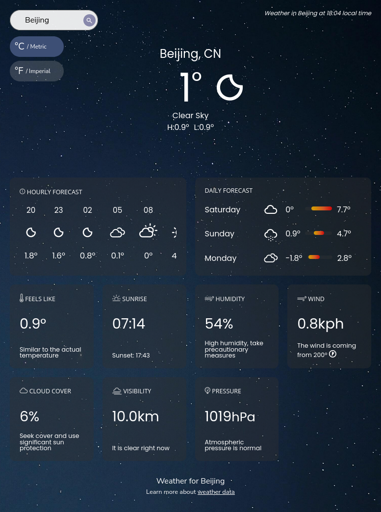
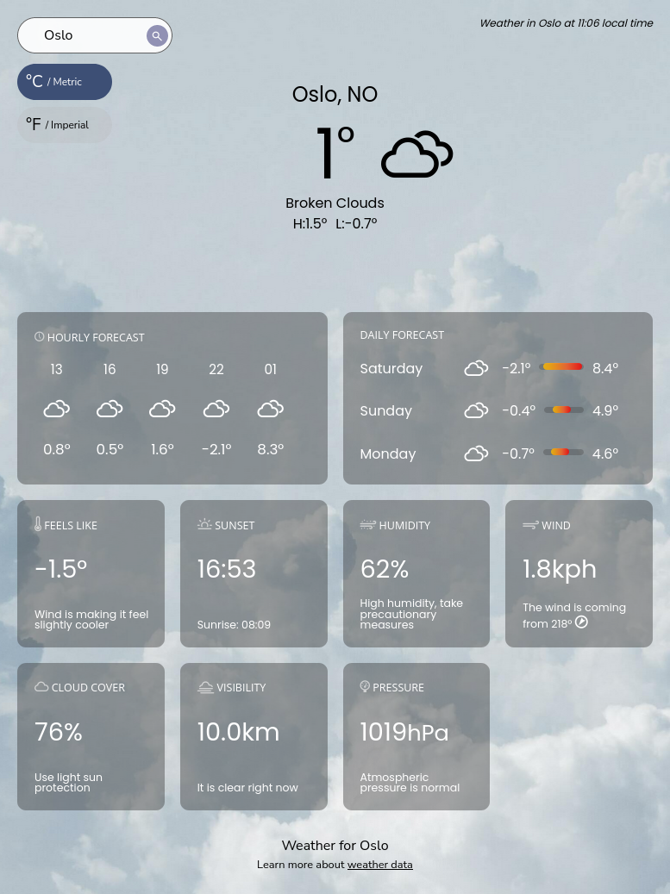

## The Odin Project

# Project: Weather app

**Live version** of the site can be found [here](https://vignesh0220.github.io/weather_app/)

This weather app gets the user's local coordinates through the Geolocation API and displays the weather data of that location. You can also search for the weather data of cities around the world.

This weather app displays the weather data of any city around the world! Just type whichever city in the search bar and the display will populate the data.

Features:

1. _*Get local weather data*_
   The app gets the user's location data on initialization if the user has location access turned on. The local weather will then be displayed shortly afterwards. If location access is disabled, the app defaults to London, UK.

2. _*Search for any city in the world*_
   The GeoDB cities API allows the app to get city data all over the world which is then used to display the local weather for that area. Search results are sorted by decreasing population order.

3. _*Get units in either metric or imperial*_
   You can get your weather data--including temperature, wind speed, atmospheric pressure, etc.--in either metric or imperial units.

### Built With

- Vanilla JS
- HTML5
- CSS

### Getting Started

In order to setup and work on this project on your own, you will need to:

1. Clone this project:  
   `git clone https://github.com/vignesh0220/weather_app.git`

2. Once you have cloned this project, you can install the required dependencies by using:  
   `npm install`

3. A live demo of the project can be started by using:  
   `npm start`

4. Distribution files can be produced using:  
   `npm run build`

### Acknowledgments

The app uses the following APIs to receive pertinent data:

1. [GeoDB Cities API](http://geodb-cities-api.wirefreethought.com/)
2. [Open Weather API](https://openweathermap.org/api)

Background images used to display the weather are from the following creators on [Unsplash](https://unsplash.com/):

1. [Olena Sergienko](https://unsplash.com/@olenkasergienko)
2. [elCarito](https://unsplash.com/@elcarito)
3. [Adam Chang](https://unsplash.com/@sametomorrow)
4. [Artem Sapegin](https://unsplash.com/@sapegin)
5. [Alex Gindin](https://unsplash.com/@alexgindin)
6. [Andreas Brun](https://unsplash.com/@andreasbrun)
7. [Andrew Seaman](https://unsplash.com/@amseaman)
8. [Antoine Barres](https://unsplash.com/@antoinebarres)
9. [Peyman Farmani](https://unsplash.com/@peymanfarmani)
10. [Anne Nygard](https://unsplash.com/@polarmermaid)
11. [Anant Chandra](https://unsplash.com/@anant347)
12. [Elia Clerici](https://unsplash.com/@ielix)
13. [Priya Bhagtani](https://unsplash.com/@priya1007)
14. [Magnus Ostberg](https://unsplash.com/@magnusostberg)
15. [Ben Owen](https://unsplash.com/@circleb)

Weather icons used for the project are from [Erik Flowers / Weather Icons](https://github.com/erikflowers/weather-icons).

Loading spinner icon used for the project is from [Loading.io](https://loading.io/css/)

### Deployed on GitHub Pages

Deployed on [GitHub Pages](https://pages.github.com/)

### Display

Nighttime weather view

Daytime weather view

---

Developed by **Vignesh J**
